# ECS code-server deployment

A production-style deployment of [coder/code-server](https://github.com/coder/code-server) on AWS ECS Fargate, built manually in the AWS Console first, then fully rebuilt as modular Terraform, with GitHub Actions CI/CD authenticating via OIDC (no static AWS keys).

Live URL: `https://tm.tanvirahmed.uk` (currently torn down between sessions to avoid idle AWS cost — see [Reproducing this deployment](#reproducing-this-deployment))

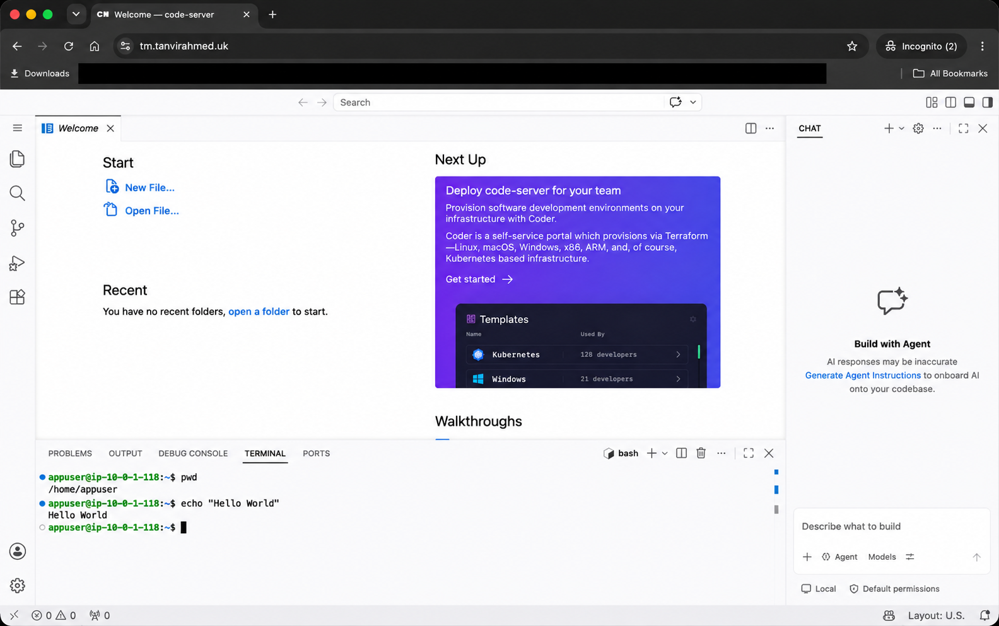

## Overview

This project takes an open source, non trivial application (code-server - a fully functional browser-based VS Code environment) and deploys it using a production style architecture: containerised, fronted by an ALB with a custom domain and HTTPS, orchestrated by ECS Fargate, and deployed through an automated CI/CD pipeline rather than manual deployment.

The brief called for exactly this progression, and the project follows it in order:

1. Run the app locally, outside Docker
2. Containerise it (multi-stage, non-root user, minimal image)
3. Push to a private container registry (ECR)
4. Deploy manually via the AWS Console ("ClickOps") to understand every moving part
5. Tear it down and rebuild identically as modular Terraform
6. Automate builds and deployments with GitHub Actions, using OIDC

## Tech stack

| Area | Technologies |
| --- | --- |
| **Application and proxy** | code-server, Nginx |
| **Containerisation** | Docker, multi-stage builds |
| **Infrastructure as code** | Terraform, TFLint |
| **AWS infrastructure** | ECS Fargate, Application Load Balancer, VPC, ECR, Route 53, ACM, Secrets Manager, CloudWatch Logs, IAM and S3 |
| **CI/CD and authentication** | GitHub Actions, GitHub OIDC federation |
| **Domain and DNS delegation** | Cloudflare |

## Architecture

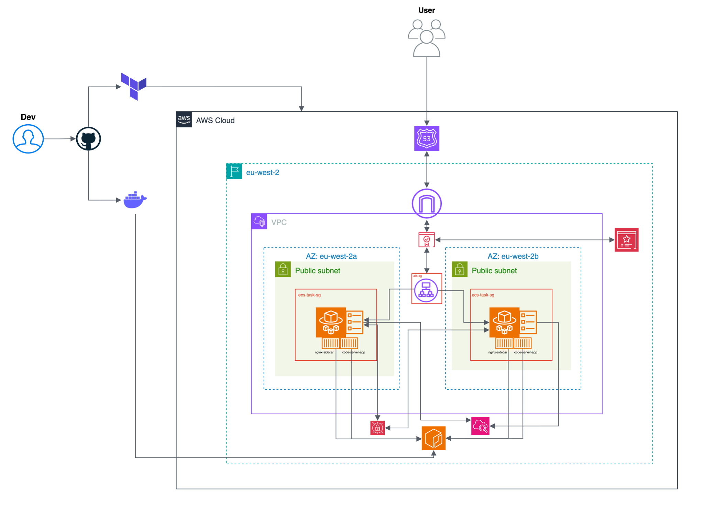

A request reaches `tm.tanvirahmed.uk` via Route 53, hits an Application Load Balancer (TLS terminated with an ACM certificate, HTTP forced to redirect to HTTPS), and is forwarded to a single ECS Fargate task. Using `awsvpc` networking, each task recieves its own ENI and runs two containers that share the same namespace and communicate over `localhost`.

<!-- The task runs two containers sharing one network interface (`awsvpc` mode): -->

- **nginx-sidecar** (port 8081) — the only container the ALB ever talks to. It exposes `/health`, which does **not** just return a static "ok" — it performs an internal `auth_request` subrequest to code-server's native `/healthz` endpoint before returning a successful response. This ensures the ALB reports the task as healthy only when both Nginx and the underlying application are operational. All other traffic is reverse-proxied to code-server-app, including the WebSocket upgrade required by the integrated terminal.
- **code-server-app** (port 8080) — runs the actual application, reachable by nginx-sidecar only, never exposed directly through the ALB.

At task startup, the container images are pulled from **Amazon ECR**, the code-server login password is injected securely from **AWS Secrets Manager** (never stored in Terraform state or CI), and logs from both containers are streamed to separate **CloudWatch** streams.

### A deliberate departure from "standard" AWS reference architecture

There is no private subnet and no NAT Gateway anywhere in this design. The ECS task runs in a **public subnet** with a public IP, and the actual security boundary is the security group (`ecs-task-sg`), which only accepts inbound traffic from the ALB's security group (`alb-sg`) — never from the wider internet. This was a conscious cost decision: a NAT Gateway costs a fixed hourly rate plus per-GB data charges indefinitely, which isn't justified for a project at this scale. The tradeoff is documented, not accidental.

### CI/CD flow

The delivery process is split across two GitHub Actions workflows, with image creation and deployment deliberately separated by a manual promotion gate:

- **`build-push.yaml`** — triggers automatically when a push to `main` changes files under `app/**`. It builds both images, tags them with the short git commit SHA, and pushes them to their respective ECR repositories. The workflow assumes a narrow IAM role (`github-actions-ecr-push`) that can only push to the two specific ECR repositories used in this project.
- **`terraform-deploy.yaml`** — triggers only via manual `workflow_dispatch`, requiring the operator to type in the image tag to deploy (no default value). Before deployment, the workflow runs `terraform fmt -check`, `validate`, and `tflint` as quality gates, then `terraform plan` and `terraform apply`. It then waits for the ECS service to stabilise, then performs a health check against the live `/health` endpoint, failing the pipeline if the application doesn't return `200` response. This workflow assumes a broader IAM role (`github-actions-terraform-deploy`), with permissions limited to the AWS resources and operations required by Terraform.

Deploy is a deliberate gate rather than automatic-on-push, mirroring a common real world pattern: build continuously, promote/deploy on purpose.

Both workflows authenticate to AWS through GitHub OIDC, using short lived credentials rather than stored access keys.

## Repository structure

```
.
├── app/
│   ├── code-server/
│   │   ├── Dockerfile          # multi-stage, non-root, debian:bookworm-slim
│   │   └── .dockerignore
│   └── nginx/
│       ├── Dockerfile          # nginxinc/nginx-unprivileged, non-root by default
│       ├── nginx.conf          # auth_request health check, websocket upgrade
│       └── .dockerignore
├── bootstrap/                  # one-time, manually-applied foundational infra
│   ├── main.tf                 # S3 state bucket (versioned, encrypted)
│   ├── oidc.tf                 # GitHub OIDC provider + two IAM roles
│   ├── secrets.tf              # Secrets Manager secret for PASSWORD
│   ├── variables.tf
│   ├── terraform.tfvars        # gitignored — real password value
│   └── terraform.tfvars.example

├── infra/                      # the routinely destroy/apply'd application stack
│   ├── main.tf
│   ├── variables.tf
│   ├── outputs.tf
│   ├── provider.tf
│   ├── backend.tf              # S3 backend, native locking
│   ├── .tflint.hcl
│   ├── terraform.tfvars        # gitignored — real values
│   ├── terraform.tfvars.example
│   └── modules/
│       ├── vpc/
│       ├── ecr/                # see Known limitations — lives here, not bootstrap/
│       ├── alb/
│       ├── ecs/
│       ├── acm/
│       └── dns/
├── .github/workflows/
│   ├── build-push.yaml
│   └── deploy.yaml
└── docs/
    ├── architecture.svg
    └── screenshots/
```

## Design decisions

| Decision | Rationale |
|---|---|
| Nginx sidecar in front of code-server | code-server exposes `/healthz`, while this project requires a `/health` endpoint. Nginx provides that external contract and returns success only after verifying the application’s native health endpoint, preventing a healthy proxy from masking a failed backend. |
| `debian:bookworm-slim`, rather than Alpine, for code-server | code-server's official release includes a prebuilt `node-pty` native binary linked against glibc. Alpine uses musl libc, which can cause runtime incompatibilities with Node.js dependencies. Debian slim preserves binary compatibility while keeping the image relatively small. |
| Public subnets with no NAT Gateway | This is a cost-conscious decision for a portfolio workload. The task instead gets a public IP directly, giving it access to ECR and other AWS services without the recurring cost of a NAT Gateway. Inbound traffic remains restricted by the task security group to port `8081` from the ALB security group; code-server’s port `8080`is not externally permitted. For a production workload, private subnets with NAT or VPC endpoints would provide stronger network isolation. |
| Immutable ECR images, tagged with the Git commut SHA | Each deployed image can be traced to the exact commit that produced it. ECR tag immutability prevents an existing tag from being silently overwritten and makes deployments and rollbacks deterministic. |
| ECS resources written directly in Terraform | The ECS layer contains the project’s most application-specific configuration: a two-container sidecar task, container dependencies, logging, secrets, networking and load-balancer integration. Defining these resources directly makes those relationships explicit and shows how the underlying ECS components work. |
| Security group owned by their module; cross-referencing rules live in the root | The ALB and ECS modules each own and export their security group. Rules that require IDs from both modules are composed in the root configuration, where both values are available, avoiding circular module dependencies. |
| Route 53 hosted zone is not Terraform-managed | Destroying and recreating a hosted zone generates a new set of nameservers every time, requiring re-delegation from the domain's registrar (Cloudflare) and a fresh propagation wait. The zone is created once and referenced via a Terraform `data` source. |
| Secrets Manager secret created in `bootstrap/`, separated from the application stack | The long-lived secret is created in `bootstrap/` and referenced by ARN from `infra/`, allowing routine infrastructure deployments and destruction to leave it intact. The secret value is populated separately so that the deployment pipeline and application state handle only the ARN, while ECS injects the value at task startup. |
| Two separate GitHub Actions workflows, connected by a manual SHA input | Build is safe to automate on every push. Deploy can cost money and modify live infrastructure, so it's a deliberate `workflow_dispatch` gate requiring an operator to explicitly choose which image tag to deploy. |
| GitHub OIDC with separate, least-privilege CI roles | GitHub Actions exchanges its OIDC token for short-lived AWS credentials, avoiding stored access keys. The build/push job only ever needs ECR push permissions. The Terraform job needs much broader access. Separating the roles limits the blast radius if either workflow is compromised. |
| Separate bootstrap and application Terraform lifecycles | Foundational resources (including the remote state bucket, GitHub OIDC integration, CI roles and long-lived secrets) are managed separately from the application infrastructure. This allows `infra/` to be recreated without removing the state backend or the credentials required to deploy it. |

## Known limitations

- **No persistent storage.** The ECS Fargate tasks use ephemeral storage, so any files created inside the code-server workspace is lost on task restart. Mounting an EFS volume would add persistent storage, but this was deferred to keep the project focused on container orchestration, infrastructure as code, and delivery automation.
- **ECS tasks run in public subnets.** Assigning each task a public IP provides outbound access to ECR and other AWS services without the cost of a NAT Gateway. Inbound access remains restricted by security groups to traffic from the ALB; however, a more isolated production design would place tasks in private subnets and provide outbound connectivity through a NAT Gateway or VPC endpoints.
- **The Route 53 hosted zone,is a one-time manual/local steps.** Full automation of the Cloudflare NS delegation step specifically would require adding the Cloudflare Terraform provider and a second set of credentials, which was deferred to keep the prject scope proportionate.
- **ECR lives inside `infra/`, not `bootstrap/`.** This creates a real bootstrapping order dependency: `build-push.yaml` cannot push images until the ECR repositories exist, but those repositories are only created by `terraform apply` on `infra/`. In practice this means the very first deploy of a fresh `infra/` stack has to be run once with a placeholder `image_tag` (the ECS service will fail to place tasks until real images exist — harmless, since `terraform apply` doesn't block on tasks actually starting), `build-push.yaml` can then push real images, and `terraform-deploy.yaml` is re-run with the real tag to let the service stabilise. It also means every full `terraform destroy` of `infra/` deletes the pushed images along with everything else, requiring a re-push before the next deploy. The cleaner design — moving the `ecr` module into `bootstrap/`, alongside the other foundational, rarely destroyed resources — was identified but deliberately not carried out this late in the project, to avoid re-testing the full pipeline against a Terraform state migration this close to completion. 
- **Observability is limited to logs and health checks.** Container logs are centralised in CloudWatch, and the deployment workflow verifies the live `/health` endpoint. The project does not yet include operational dashboards, CloudWatch alarms, or automated notifications for unhealthy targets, elevated error rates, resource saturation, or repeated task failures.
- **No automatic deployment rollback.** The deployment workflow waits for the ECS service to stabilise and performs a health check against the live endpoint. If either check fails, the workflow reports the deployment as unsuccessful, but it does not automatically restore the previous working task definition. A future iteration would enable the ECS deployment circuit breaker with rollback, allowing ECS to detect a failed deployment and automatically revert the service to its last successful deployment.

## Reproducing this deployment

> **Note:** This repository is not currently parameterised for a fresh AWS account or a different GitHub repository. The AWS account ID and the GitHub `owner/repo` are hardcoded in a few places — `bootstrap/oidc.tf`'s OIDC trust policy condition, and the `role-to-assume` ARNs in both `.github/workflows/*.yaml` files. Reproducing this in your own account/repo means updating those values first, or the OIDC authentication step will fail.

### Prerequisites

- An AWS account
- A domain with a DNS provider that supports delegating a subdomain via NS records (this project used Cloudflare)
- Terraform >= 1.10, Docker, AWS CLI, a GitHub repository (forked or your own)

### 1. Bootstrap (one time, run locally)

```bash
cd bootstrap
# create terraform.tfvars with a real code_server_password value
terraform init
terraform apply
```

This creates the S3 state bucket, the GitHub OIDC provider and IAM roles, and the Secrets Manager secret. Note the two role ARNs it outputs — they're referenced directly in the two workflow files.

### 2. DNS delegation (one time, manual)

```bash
aws route53 create-hosted-zone --name tm.<your-domain> --caller-reference "$(date +%s)"
```

Take the four nameservers from the output and add them as `NS` records for the `tm` subdomain at your DNS provider. Verify with `dig NS tm.<your-domain>` before continuing.

### 3. First-time deploy (creates the ECR repositories)

The ECR repositories are created by `infra/`, but `build-push.yaml` needs them to exist before it can push anything — so on a genuinely fresh AWS account, deploy once first with any placeholder tag:

```
Actions → Terraform Deploy → Run workflow → image_tag: bootstrap
```

The ECS service will fail to place tasks (no image exists yet at that tag) — this is expected and harmless; every other resource, including the ECR repositories, will have been created successfully.

### 4. Build and push the real images

Push a commit touching `app/**` to `main` — `build-push.yaml` will build and push both images automatically. Note the short SHA it produces.

### 5. Deploy for real

Go to **Actions → Terraform Deploy → Run workflow**, and enter the SHA from step 4 as the `image_tag` input. The service should now stabilise successfully.

> This two-step first deploy is a direct consequence of the ECR module living in `infra/` rather than `bootstrap/` — see [Known limitations](#known-limitations). On every subsequent redeploy where the repositories already exist and hold images, step 3 isn't needed.

### 5. Verify

```bash
curl -i https://tm.<your-domain>/health
```

Should return `200 {"status": "ok"}`.

### Tearing down

```bash
cd infra
terraform destroy
```

`bootstrap/` is left running — it holds no meaningful ongoing cost and is what lets `infra/` be rebuilt cleanly without re-doing DNS delegation, OIDC trust, or the secret.

## Debugging log: issues encountered and resolved

These incidents are included because diagnoisng unexpected behaviour was as important as producing the final working architecture.

1. **Nginx and code-server initially competed for the same port.** Both containers share a network namespace, which means they cannot bind to the same address and port. Code-server was already listening on `8080`, so Nginx failed when it attempted to use the same port. Container logs and `nginx -t` identified the bind failure. Nginx was moved to 8081, with the Docker port mapping, ECS container definition and ALB target group updated accordingly.
2. **The health endpoint initially verified only Nginx, not the application behind it.** A static `200` response from `/health` could allow the task to remain registered as healthy even if code-server had failed. The endpoint was redesigned to use an internal Nginx `auth_request` subrequest against code-server’s native `/healthz` endpoint. Nginx now returns success only when the upstream application responds successfully, and returns `503` when it does not.
3. **The ECS task security group had no outbound rule at all.** Security groups created via the AWS Console get an implicit "allow all outbound" rule automatically; a Terraform-managed `aws_security_group` with no `egress` block does not replicate that default. The task could resolve ECR's DNS name but every connection attempt timed out. A layer by layer network check (covering DNS resolutions, route table, then security group rules) isolated the missing egress rule, which was then added explicitly.
4. **`terraform destroy` deletes ECR repository contents, not just the repositories.** Terraform can recreate the repository resources, but it does not rebuild or republish their contents. After a full infrastructure teardown, both images therefore had to be pushed again before ECS could start successfully. Another provider specific issue appeared around `force_delete = true`: the setting had to be applied before the subsequent destroy operation so that it was recorded in state and available when the repository was deleted.
5. **GitHub Actions could not assume the AWS roles through OIDC.** The original trust policy used an invalid GitHub subject containing repository identifiers that do not appear in the token’s sub claim. AWS therefore rejected `sts:AssumeRoleWithWebIdentity` before repository permissions were evaluated. Inspecting the deployed role trust policy showed that the condition needed to match GitHub’s actual `repo:<owner>/<repository>:...` format. The condition was corrected to match `repo:tanvir039/ecs-vscode-webapp:*`, with the required `sts.amazonaws.com` audience, for both CI roles.
6. **`PowerUserAccess` was insufficient for Terraform’s IAM operations.** The Terraform deploy role could plan and apply most application infrastructure, but failed on `iam:GetRole` when managing the ECS execution role. Rather than replacing it with a broader administrator policy, a supplemental policy was added with the IAM actions Terraform required, restricted to the project’s `ecs-code-server-*` roles and including the necessary `iam:PassRole` permission.
7. **A semantically incorrect container definition bypassed static checks.** The ECS container definition used an `environment` block with a `valueFrom` key inside it — syntactically valid JSON, but `valueFrom` is only meaningful inside a `secrets` block. ECS silently ignored the unrecognised field. `terraform validate`, `plan`, and `tflint` all passed cleanly throughout, because the mistake was semantic (what ECS's API expects inside that specific key), not structural. Only caught by reading actual CloudWatch startup logs and noticing code-server reported `Using password from config.yaml` instead of `Using password from $PASSWORD`. Moving the entry into secrets corrected the injection from Secrets Manager.
8. **A stale local variable selected an obsolete image tag.** A local `terraform apply`, run outside the CI pipeline, automatically loaded an old `image_tag` from `terraform.tfvars` and registered a task definition referencing an image that was no longer available. ECS subsequently returned `CannotPullContainerError`.  Comparing the task definition’s image URI with the tags present in ECR exposed the mismatch - the file still referenced a commit SHA from early in the project, silently overriding whatever tag the pipeline had actually been deploying. Updating the local variable restored consistency with the CI deployment.


## Deployment evidence

### 1. Local containerisation

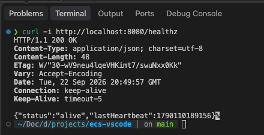

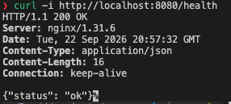

### 2. Container registry

Both container images were built, tagged with the Git commit SHA and pushed to Amazon ECR.

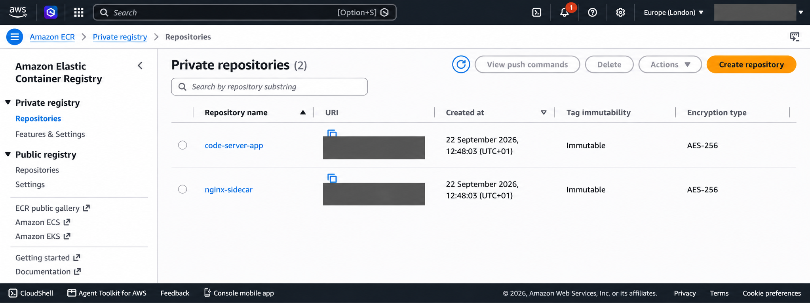

---

### 3. ECS and load balancer

The ECS service maintains one running Fargate task containing the Nginx and code-server containers.

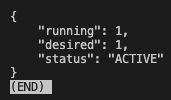

The Application Load Balancer registers the Nginx container as a healthy target on port `8081`.

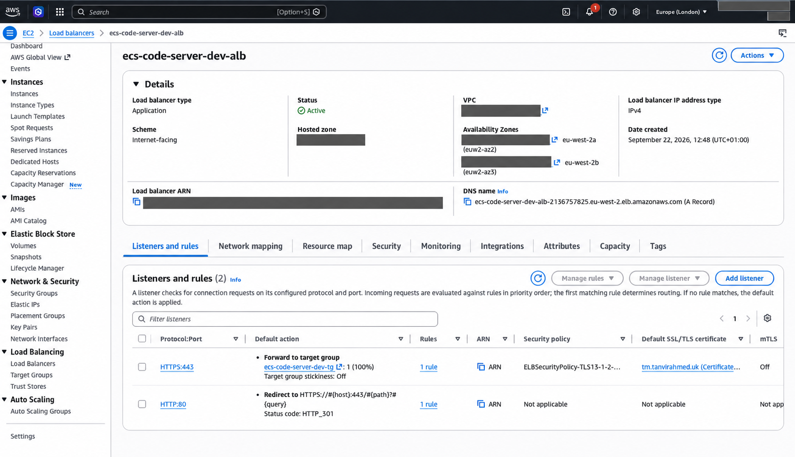

---

### 4. HTTPS and DNS

The ACM certificate was successfully issued for the application domain.

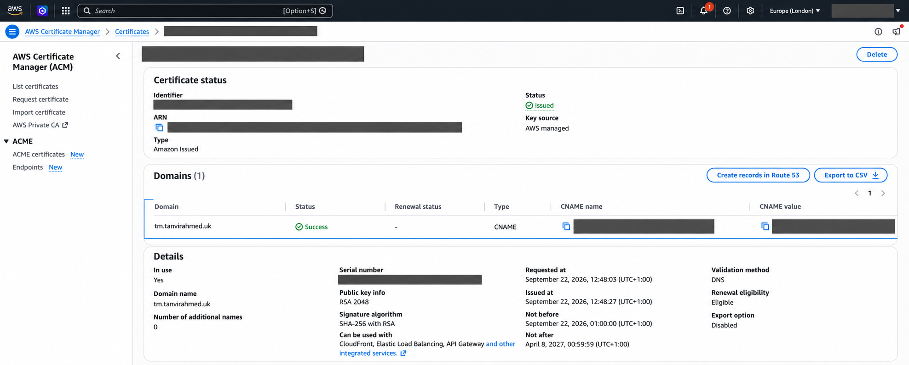

The Route 53 alias record directs the application domain to the Application Load Balancer.

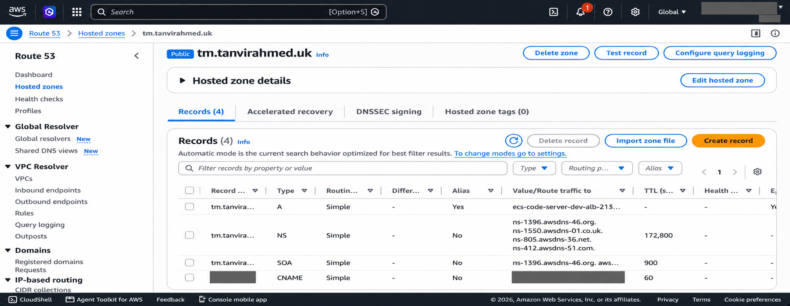

---

### 5. CI/CD pipelines

The build workflow successfully built both images and pushed their immutable SHA-tagged versions to ECR.

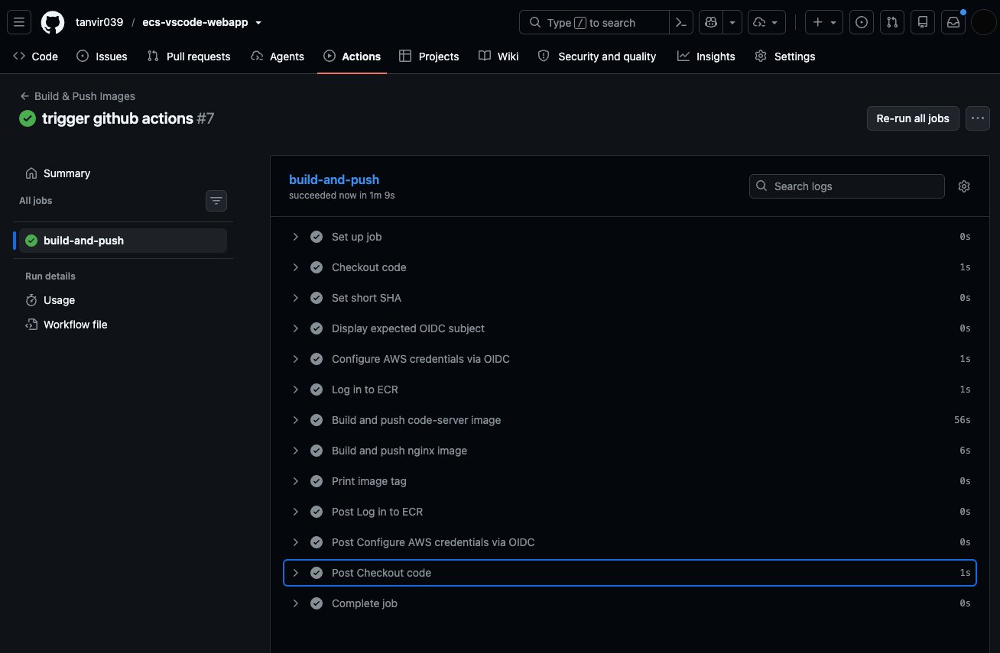

The deployment workflow applied the Terraform configuration, waited for ECS to stabilise and completed the post-deployment health check.

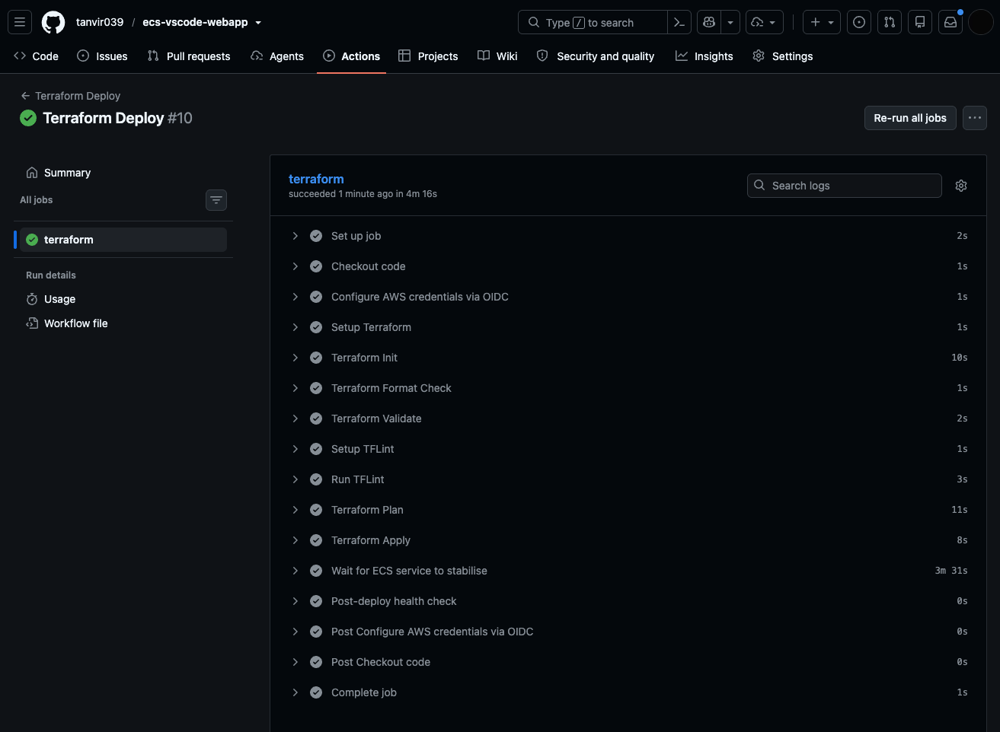

---

### 6. Live application

Code-server is accessible through the custom domain over HTTPS.

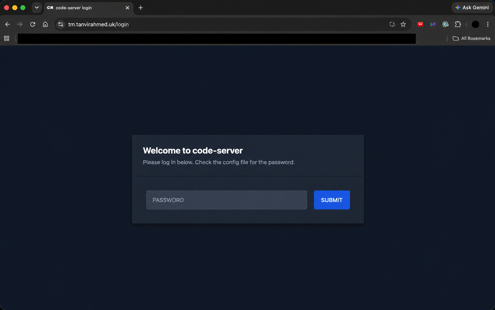


